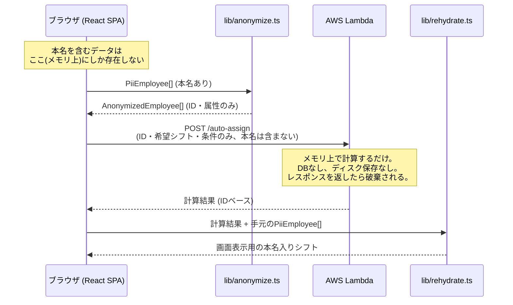

# shifuto-app-local

現場のシフト作成業務を効率化しつつ、**個人情報漏洩のリスクを物理的にゼロにする**ことを目的としたシフト管理Webアプリ。

データベースを持たない。従業員の本名を含む個人情報は、ブラウザのメモリ上にしか存在せず、サーバー（AWS Lambda）には一切送信・保存されない。

## 個人情報保護アーキテクチャ



この境界は「気をつける」ではなく、次の3層で**物理的・機械的に強制**している。

1. **型レベル**: `AnonymizedEmployee` は `readonly __anonymized: true` というブランドマーカーを持つ。これを付与できるのは `apps/web/src/lib/anonymize.ts` の `anonymizeEmployee()` だけで、`PiiEmployee`（本名を含む型）をそのまま渡すとコンパイルエラーになる。
2. **モジュール境界**: `apps/api/**` と `apps/web/src/lib/api/**` から `types/pii` を import すると、`npm run check:pii`（`scripts/check-pii-boundary.mjs`）がビルド前に検出して失敗させる。CIの `pii-boundary` ジョブで毎回実行される。
3. **ランタイム検証**: Lambda側は zod で受信データを検証し、`__anonymized: true` を持たない・想定外のフィールドを持つリクエストは弾く（`apps/api/src/lib/validateRequest.ts`）。ネットワーク越しの生JSONは型で守られないため、ここが最後の砦。

## 技術構成

| レイヤー | 技術 |
|---|---|
| フロントエンド | Vite + React 19 + TypeScript、Tailwind CSS v4、react-router |
| ホスティング | Vercel（静的ホスティングのみ。サーバー実行は一切持たない） |
| バックエンド | AWS Lambda + API Gateway（Node.js/TypeScript、AWS SAM） |
| データベース | なし（意図的に持たない） |
| ローカル永続化 | JSONファイルのエクスポート/インポートのみ（LocalStorage不使用） |

## データの取り込み・保存の使い分け

- **JSON保存/読込**（Navの「保存(JSON)」「読み込み」）: 作業中の状態（従業員・全計画のシフト・希望休・必要人数・勤務ルール）を丸ごとスナップショットして、あとで完全に復元するためのもの。作業の一時中断・再開用。
- **Excelインポート**（従業員画面・希望休入力画面）: 現場にある従業員名簿・希望休一覧をシフト表に取り込むための入口（`lib/import/`）。従業員画面のテンプレートはサンプル入りの「従業員」シート、希望休入力画面のテンプレートは**登録済みの従業員名があらかじめ入った**「希望休」シート（この画面は従業員登録済みが前提のため）。説明書きはデータ行に混ぜず「使い方」シートに分離している（データ行に注意書きが紛れて誤読み込みされる事故を防ぐため）。
- **Excel出力**（シフト表画面の「Excelに出力」）: 完成したシフト表を本名入りでダウンロードするための、一方向の出力専用機能。

## リポジトリ構成

```
packages/shared-core/   フロント/Lambda共有の型・純粋ロジック（PIIを含まない）
  types/pii.ts            本名を含む型。apps/api と lib/api からのimportは禁止
  types/anonymized.ts     ID化された型
  validation/checkViolations.ts   シフト違反検知（希望休・連勤・週間労働時間・人員不足）
  scheduling/autoAssignShifts.ts  自動シフト割当アルゴリズム

apps/web/               Vite + React SPA（Vercelでホスト）
  src/lib/anonymize.ts     本名→ID変換の唯一の入口
  src/lib/rehydrate.ts     Lambda結果+本名の再結合
  src/lib/api/lambdaClient.ts  Lambda呼び出しの唯一の入口
  src/state/               Context + useReducer によるグローバル状態管理
  e2e/                      Playwright E2Eテスト

apps/api/                AWS Lambda + API Gateway（AWS SAM）
  template.yaml             SAMテンプレート（APIキー + Usage Plan + CORS）
  src/handlers/             Lambdaハンドラ（shared-coreの純粋関数を呼ぶだけ）
```

## セットアップ

```bash
npm install
```

### フロントエンドの開発

```bash
npm run dev   # http://localhost:5173
```

Lambda連携（自動割当機能）を試すには `apps/web/.env.local` に以下を設定する。

```
VITE_API_BASE_URL=https://<api-gateway-url>
VITE_API_KEY=<APIキー>
```

未設定でも、ローカル完結の機能（従業員管理・手動シフト編集・希望休・必要人数設定・Excel出力・JSON保存/読込）はすべて動作する。

### バックエンド（Lambda）のローカル実行

2通りの方法がある。

**軽量devサーバー（Docker/SAM CLI不要、まずはこちらで動作確認するのがおすすめ）**

`apps/api/dev-server.ts` がハンドラ関数をそのままNodeのhttpサーバーでラップして起動する。API Gatewayの認証・CORS・スロットリング等の挙動は再現しないが、ロジックの動作確認には十分。

```bash
npm run dev --workspace=apps/api   # http://localhost:3001
```

`apps/web/.env.local` の `VITE_API_BASE_URL` をこのURL（`http://localhost:3001`）に向ければ、フロントエンドから自動割当ボタンで叩ける。

**AWS SAM CLI（本番により近い構成で検証したい場合）**

Docker Desktop と AWS SAM CLI（`brew install aws-sam-cli`）が必要。

```bash
cd apps/api
sam build
sam local start-api   # デフォルトで http://localhost:3000
```

この場合 `VITE_API_BASE_URL` は `http://localhost:3000` に向ける。

## テスト

```bash
npm run test          # 全workspaceのユニットテスト (vitest)
npm run build          # 型チェック + ビルド
npm run check:pii      # PII境界チェック
cd apps/web && npm run test:e2e   # Playwright E2E（フィルハンドルD&D、JSON往復、自動割当のPII非送信確認など）
```

E2Eテストをローカルで実行する場合、Playwright付属のChromiumがサポートしないmacOSバージョンでは `npx playwright install chrome` でシステムのGoogle Chromeを使う設定になっている（`playwright.config.ts` 参照）。CI（Ubuntu）はPlaywright付属のChromiumをそのまま使う。

## デプロイ

- **フロントエンド**: VercelプロジェクトにGitHubリポジトリを接続済み（Root Directory: `apps/web`）。`main`へのpushで自動デプロイされる。接続前は`vercel`CLIから手動デプロイしていた（モノレポ構成のため、`apps/web`単体ではなくリポジトリルートからのデプロイ＋Root Directory設定が必要。git情報を含む状態でCLIデプロイすると「commit authorの権限」エラーになることがあるため、その場合は`git archive`等で`.git`を含まないコピーからデプロイする）。
- **バックエンド**: `.github/workflows/api-deploy.yml` が `apps/api/**` の変更で自動デプロイする**想定**だが、現時点ではAWS側のOIDC用IAMロール・GitHub Secrets（`AWS_DEPLOY_ROLE_ARN` / `AWS_REGION` / `WEB_ORIGIN`）が未設定のため、このワークフローは実行されると失敗する。現状は`aws cloudformation package`/`deploy`を手元から直接実行する手動デプロイのみで運用している（自動化する場合はOIDCロール作成とSecrets設定が必要）。

### バックエンド手動デプロイの手順（sam CLIが使えない/使わない場合）

`sam build`はesbuildの薄いラッパーに過ぎないため、sam CLIそのものが無くても以下で代替できる。

```bash
# 1. ハンドラをesbuildで直接バンドル
npx esbuild apps/api/src/handlers/autoAssignShifts.ts \
  --bundle --platform=node --target=node20 --format=cjs --minify \
  --outfile=<build-dir>/handlers/autoAssignShifts.js

# 2. template.yamlをコピーし、CodeUriをビルド済みディレクトリに向け、
#    Metadata（BuildMethod/BuildProperties、sam build専用）を取り除く

# 3. S3にパッケージしてデプロイ
aws cloudformation package --template-file template.yaml \
  --s3-bucket <deploy-bucket> --output-template-file packaged-template.yaml
aws cloudformation deploy --template-file packaged-template.yaml \
  --stack-name shifuto-app-local-api --capabilities CAPABILITY_IAM \
  --parameter-overrides AllowedOrigin=<VercelのフロントエンドURL>
```

**CORSに関する重要な注意**（実際にハマった箇所）:

- API Gatewayの`Auth.ApiKeyRequired`は**APIレベルではなく、POSTイベントレベル**で設定すること。APIレベルに設定すると、SAMが自動生成するCORS用OPTIONSモックメソッドにも継承され、ブラウザのプリフライトリクエスト（APIキーを付けない）が常に403になる。
- SAMの`Cors`プロパティは自動生成されるOPTIONSモックメソッドのレスポンスにしかCORSヘッダーを付与しない。**Lambda自身が返す実際のレスポンスには`Access-Control-Allow-Origin`ヘッダーを自分で付ける必要がある**（`apps/api/src/lib/httpResponse.ts`参照）。付け忘れると、プリフライトは成功するのに実際のリクエストだけブラウザに`Failed to fetch`としてブロックされる、という分かりにくい形で発覚する。

## 機能仕様

画面ごとの機能・業務ルール（必要人数・勤務ルール・違反判定・自動割当ロジック）・UI/UX上の設計判断は [docs/SPEC.md](docs/SPEC.md) を参照。

## リリース前チェックリスト

[docs/QA_CHECKLIST.md](docs/QA_CHECKLIST.md) を参照。特に「Lambdaへのリクエストに本名が含まれていないことのNetworkタブでの目視確認」は自動テストに加えて手動でも行うこと。

## 既知の制約

- 認証機能はない。社内配布URLでの運用を前提とする。API Gatewayのキーはフロントエンドのバンドルに含まれるため秘匿情報ではなく、あくまで不特定多数によるURL直叩きへの軽い抑止（+ Usage Planのレート制限）に過ぎない。
- ブラウザを閉じる/リロードするとJSONエクスポートしていないデータは失われる（意図的な設計）。
